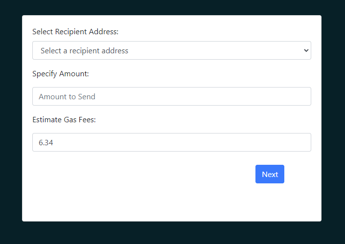
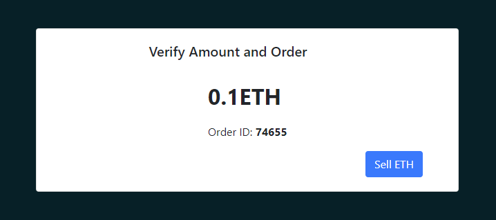

<u><h3>Procedure</h3></u>

In this simulation you'll actively learn about ethereum , explore digital wallets like metamask and how transactions happens in metamask 
Carefully read the provided information ,  After thoroughly understanding the information, move on to the next concept in the sequence 

click next to view the next concept and previous to view the previous concept for revision .

<h6>create a new MetaMask wallet</h6>
Click on the create button to create and setup metamask account ,read the instructions carefully before starting the process.

<h6>Create a strong password for your wallet.</h6>

<h6>Securely store the seed phrase for your wallet</h6>
This is a very important step! Next you'll be presented with your Secrete Backup Phrase. This is your super secret password which provides access to your wallet. If you lose this phrase, you lose access to your tokens. If someone else gets this phrase, they get access to your wallet.

<h6>Seed phrase confirmation</h6>
Confirm your secret backup phrase, by entering the missing pharse in the correct order in which the words were presented on the previous screen. Click on “Confirm” to proceed.

Now that you have your wallet set up, you can see the metamask dashboard 

Click on the "Resume Learning " button to continue to next step, read the instructions carefully and click on "try yourself" to practically experience how transactions happen in metamask 

Read the instructions carefully and click on "try yourself" to practically experience how transactions happen in metamask 

You can select any transaction method and see how transaction happen in metamask and transaction history will show your recent transaction . click on the information icon for more details .
<h6>how to Buy ETH in metamask</h6>
click on the buy button in the dahsboard ,select payment method you want to procced with 

click next button , a verification form will appear fill the form correctly and click verify

Enter the amount of ETH you need to buy and the corresponding currency amount will be shown below .

click next and review the purchase order 

<h6>how to Send ETH in metamask</h6>
click on the Send button in the dahsboard, select the account from which you want to send the ETH .

Click next and enter the amount of eth you want to send , the estimated gas fee(The fee paid to miners for processing the transaction) will be shown 

click next button and review the transaction

<h6>how to sell the ETH in metamask</h6>
click the sell button in the dashboard and , select the region from the options provided .

click next and enter the required details, you could also select the provider from the options.

click the next button and fill the form for verification 

click next and choose bank account to proceed further

click sell eth button to proceed further 

Review the transaction details and click finish button 

After each transaction , transaction history will show the recent transaction .

